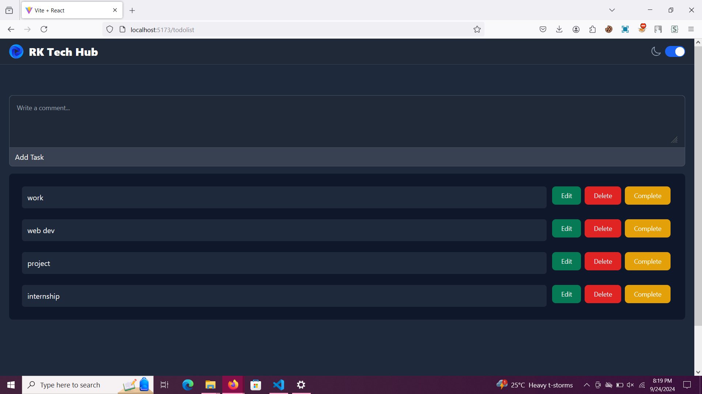

# React To-Do List Application

## Project Overview

This project is a  **To-Do List** application built using React. The app allows users to add tasks, mark them as complete, edit tasks, and delete them. It is built with a clean and minimal UI and uses React state to manage tasks.

## Features

- **Add a Task**: Users can add a new task to the list by typing into the input field and clicking the 'Add' button.
- **Mark as Complete**: Tasks can be marked as complete by clicking a checkbox. Completed tasks will have a strikethrough effect.
- **Edit a Task**: Users can edit the content of a task by clicking the edit button and updating the task text.
- **Delete a Task**: Tasks can be removed from the list by clicking the delete button.

## Technologies Used

- **Frontend**: React (JSX, Hooks, State)
- **CSS**: Tailwind 

